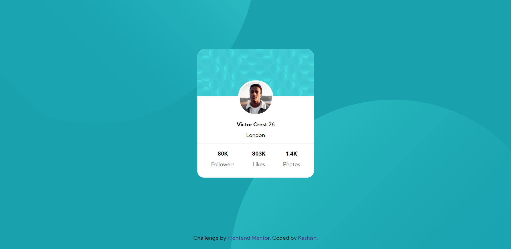

# Frontend Mentor - Profile card component solution

This is a solution to the [Profile card component challenge on Frontend Mentor](https://www.frontendmentor.io/challenges/profile-card-component-cfArpWshJ). Frontend Mentor challenges help you improve your coding skills by building realistic projects. 

## Table of contents

- [Overview](#overview)
  - [The challenge](#the-challenge)
  - [Screenshot](#screenshot)
  - [Links](#links)
- [My process](#my-process)
  - [Built with](#built-with)
  - [What I learned](#what-i-learned)
- [Author](#author)
- [Acknowledgments](#acknowledgments)

## Overview

### The challenge

- Build out the project to the designs provided

### Screenshot

### Links

- Solution URL: [Solution](https://www.frontendmentor.io/solutions/mobile-first-using-pure-css-html-dL4OGg8HI)
- Live Site URL: [Link ](https://k-ash-ish.github.io/Profile-card-challenge-Frontendmentors/)

## My process

### Built with

- HTML
- CSS
- Mobile-first workflow
### What I learned

  In this project learned about how can I use negative margins and different background properties and about psuedo elements ::before ::after.

## Author

- Frontend Mentor - [@K-ash-ish](https://www.frontendmentor.io/profile/K-ash-ish)
- Twitter - [@KashishSo](https://twitter.com/KashishSo)

